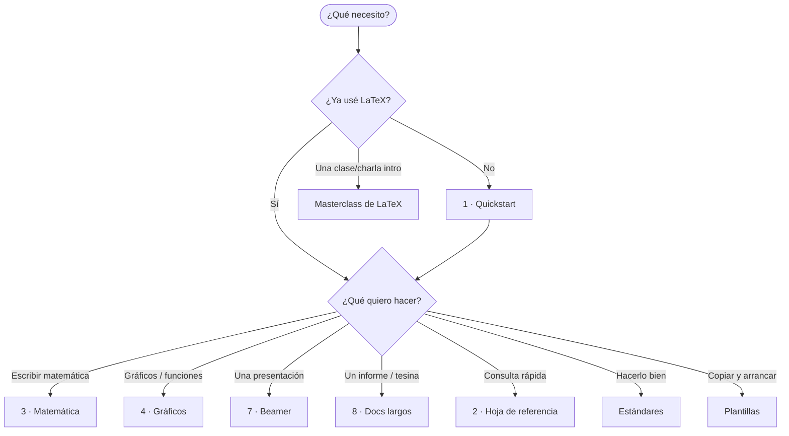

# Suite de documentos LaTeX

Una **serie de documentos cortos y complementarios** sobre LaTeX, organizada en
**niveles**. Cada documento apunta a un **lector** y un **objetivo** distintos,
está escrito en la **clase LaTeX** que mejor lo representa (es ejemplo de sí
mismo) y es *completo dentro de su tema*, sin solaparse con los demás.

> 🗺️ Para el **universo completo de temas** (estado · documento destino ·
> prioridad), ver **[TEMARIO.md](TEMARIO.md)**.

---

## Mapa de la suite (por niveles)

| Nivel | # | Documento | Propósito | Clase | Estado | Carpeta |
|:-----:|:--:|-----------|-----------|-------|:------:|---------|
| **0 · Meta** | — | **Hub** | Punto de entrada y arquitectura | md | ✅ | `README.md` |
| 0 | — | **TEMARIO** | El universo de temas LaTeX | md | ✅ | `TEMARIO.md` |
| 0 | — | **Estándares y buenas prácticas** | Preámbulo recomendado, anti-patrones, bases mín/máx | `article` | ✅ | `estandares/` |
| 0 | — | **Flujo, herramientas e instalación** | Distribuciones, compilar, editores, problemáticas | `article` | ✅ | `flujo-instalacion/` |
| **1 · Empezar** | — | **Masterclass de LaTeX** | Recorrida/charla para **desbloquear** a quien nunca lo usó | `beamer` | ✅ | `masterclass-latex/` |
| 1 | 1 | **Quickstart** | Nunca usaste LaTeX: instalar, compilar, primer doc | `article` | ✅ | `1-quickstart/` |
| 1 | 2 | **Hoja de referencia** | Consulta rápida de comandos (una carilla) | `article` apaisado | ✅ | `2-cheatsheet/` |
| **2 · Capacidades** | 3 | **Matemática** | Escribir matemática, de los modos a teoremas | `article` | ✅ | `3-matematica/` |
| 2 | 4 | **Gráficos y figuras** | Imágenes, TikZ y **graficar funciones** | `article` | ✅ | `4-graficos/` |
| 2 | 5 | **Tablas, listas y cajas** | Elementos de contenido | `article` | ✅ | `5-tablas-listas-cajas/` |
| 2 | 6 | **Referencias, índices y bibliografía** | El "aparato" del documento | `article` | ✅ | `6-referencias-biblio/` |
| **3 · Tipos de doc** | 7 | **Presentaciones (Beamer)** | La clase `beamer` **a fondo** (no es la Masterclass) | `article` | ✅ | `7-beamer/` |
| 3 | 8 | **Documentos largos** | Informe/tesina (estructura, numeración) | `report`/KOMA | ✅ | `8-documentos-largos/` |
| **4 · Avanzado** | 9 | **Programación y automatización** | Lógica, `expl3`, Lua, compilación condicional | `article` | ✅ | `9-programacion/` |
| 4 | 10 | **Publicación e interoperabilidad** | Conversión a Word/HTML, mail merge | `article` | ✅ | `10-publicacion/` |
| **5 · Recursos** | — | **Plantillas** | `article.tex` y `beamer.tex` para copiar | `.tex` | ✅ | `plantillas/` |

> **Leyenda:** ✅ listo · 🟡 en proceso · ⬜ planificado.
>
> 🎉 **Suite completa:** los 12 documentos están escritos, compilan y tienen su
> PDF. Lo que sigue es mantenimiento e iteración sobre el contenido.

> ⚠️ **Masterclass vs. doc 7 (Beamer):** la **Masterclass** es una *presentación
> sobre LaTeX en general* (para desbloquear principiantes; su formato beamer es
> incidental). El **doc 7** es sobre la *clase `beamer` en profundidad* (cómo
> hacer presentaciones). Son documentos distintos.

---

## ¿Por dónde empiezo?



---

## Dónde vive cada capa  (TEMARIO → documento)

Cada categoría del [TEMARIO](TEMARIO.md) tiene un **hogar** claro, sin
solaparse:

| Categoría(s) del TEMARIO | Documento destino |
|--------------------------|-------------------|
| 3 Matemática · 9 Código (pseudocódigo, parte) | **3 · Matemática** |
| 4 Gráficos | **4 · Gráficos y figuras** |
| 5 Tablas · 11 Cajas · 12 Listas | **5 · Tablas, listas y cajas** |
| 7 Referencias/índices · 8 Bibliografía | **6 · Referencias, índices y bibliografía** |
| 10 Beamer | **7 · Presentaciones (Beamer)** — *deep dive* (la **Masterclass** es panorama transversal de LaTeX) |
| 1 Estructura · 2 Numeración · 6 Tipografía · 16 Docs especiales | **8 · Documentos largos** |
| 9 Código · 13 Programación | **9 · Programación y automatización** |
| 18 Publicación/conversión | **10 · Publicación e interoperabilidad** |
| 6 Tipografía (base) · 14 Idioma · 17 Accesibilidad | **Estándares** |
| 15 Flujo/instalación | **Flujo, herramientas e instalación** |

---

## Estado de producción

**Todos los documentos están escritos y compilan a PDF.** Resumen por documento:

| Doc | Clase | Estado | Extensión |
|-----|-------|:------:|-----------|
| README · TEMARIO | md | ✅ | hub + universo de temas |
| Estándares | `article` | ✅ | 9 pp |
| Flujo e instalación | `article` | ✅ | 7 pp |
| Masterclass | `beamer` | ✅ | 44 pp |
| 1 Quickstart | `article` | ✅ | 7 pp |
| 2 Hoja de referencia | `article` apaisado | ✅ | 1 carilla (3 col.) |
| 3 Matemática | `article` | ✅ | ~11 pp |
| 4 Gráficos y figuras | `article` | ✅ | 7 pp |
| 5 Tablas, listas y cajas | `article` | ✅ | 6 pp |
| 6 Referencias y bibliografía | `article` | ✅ | 5 pp |
| 7 Beamer (a fondo) | `article` | ✅ | 6 pp (guía *sobre* `beamer`) |
| 8 Documentos largos | `report` | ✅ | 10 pp |
| 9 Programación | `article` | ✅ | 5 pp |
| 10 Publicación | `article` | ✅ | 4 pp |
| Plantillas | `.tex` | ✅ | `article.tex` + `beamer.tex` |

### Mantenimiento futuro (iteración, no escritura)

- Pulir contenido por feedback de uso (ejemplos, claridad).
- Mantener versiones de paquetes (`pgfplots compat`, siunitx, etc.).
- Eventual: ampliar ejemplos de cada doc según necesidad de la carrera.

---

## Decisiones abiertas

- [x] ~~¿La hoja de referencia (2) va apaisada o vertical?~~ → **apaisada a 3 columnas** (`multicol`), una carilla. ✅
- [x] ~~¿"Tablas, listas y cajas" se mantiene unido o se separa?~~ → **unido** (6 pp, balanceado). ✅

---

## Estructura de carpetas

```
latex/
├── README.md                    ← hub (nivel 0)
├── TEMARIO.md                   ← universo de temas (nivel 0)
├── estandares/                  ← estándares (nivel 0) ✅ (estandares.tex + .pdf)
├── flujo-instalacion/           ← flujo/instalación (nivel 0) ✅ (flujo-instalacion.tex + .pdf)
├── masterclass-latex/           ← Masterclass (nivel 1) ✅ (masterclass-latex.tex + ejemplo_*.tex)
├── 1-quickstart/                ← nivel 1 ⬜
├── 2-cheatsheet/                ← nivel 1 ⬜
├── 3-matematica/                ← nivel 2 ✅ (matematica.tex + .pdf)
├── 4-graficos/                  ← nivel 2 ⬜
├── 5-tablas-listas-cajas/       ← nivel 2 ⬜
├── 6-referencias-biblio/        ← nivel 2 ⬜
├── 7-beamer/                    ← nivel 3 ⬜ (deep-dive Beamer, a escribir)
├── 8-documentos-largos/         ← nivel 3 ⬜
├── 9-programacion/              ← nivel 4 ⬜
├── 10-publicacion/              ← nivel 4 ⬜
└── plantillas/                  ← nivel 5 ⬜
```

Cada carpeta planificada tiene un `README.md` que describe **qué va, para quién y
en qué estado**.

---

## Convenciones comunes de la suite

- **Estructura de cada documento:** portada → **índice en hoja aparte** → contenido.
- **Formato didáctico:** cada concepto muestra el **código** (caja resaltada) y,
  debajo, su **resultado** (precedido por "produce:").
- **Cada doc es ejemplo de sí mismo:** su preámbulo aplica la base estándar.
- **"Ver también":** cada documento cierra remitiendo a los relacionados.

## Criterios para sumar un documento nuevo

Un tema merece su **propio** documento si cumple las cuatro:

1. Tiene un **lector/objetivo claro**, distinto de los existentes.
2. Es lo bastante grande para **no entrar como sección** de otro.
3. **No se solapa**: lo que cubre no está ya en otro documento.
4. Se puede mostrar **autodemostrativamente** en una clase LaTeX adecuada.

> Si falla alguno, probablemente sea **una sección** dentro de un documento
> existente, no un documento nuevo.

## Compilar

```bash
latexmk -pdf <archivo>.tex
```

Los intermedios (`.aux`, `.log`, etc.) están ignorados por el `.gitignore` del
proyecto.
